::: {.panel-tabset}
## Data Visualization

```{r}
#| include: false
#| # backgroundcolor: "#FBEFF3"
library(fontawesome)
library(gt)
library(gtExtras)
library(lubridate)
library(tidyverse)
library(ggplot2)
library(dplyr)
library(plotly)
suppressWarnings(library(ggthemes))
library(scales)
library(janitor)

goodreads_library_export <- read_csv(str_c("C:/Users/", Sys.getenv("USERNAME"), "/Desktop/Disco Time/book/raw data/goodreads_library_export.csv"))

soup <- goodreads_library_export |> 
  clean_names() |> 
  mutate(date_read = as.Date(date_read, format = "%m/%d/%Y"),
    # at present, i don't want anything in parenthesis, it's not really part of the titles
    title = str_remove(title, " \\([^)]*\\)$"),
    
    # Fill in blanks if they're there in Dates
    original_publication_year = ifelse(is.na(original_publication_year), year_published, original_publication_year)) |> 

  select(name = title, author, date = date_read, pages = number_of_pages, year_published = original_publication_year)
  
  

df_books <- soup

# How many books are there total (across all years)?
total_books <- length(unique(df_books$name))

# How many books are there in the current year?
total_books_this_year <- df_books |> 
  filter(year(date) == year(today())) |> 
  nrow()

# How many pages were read this year?
total_pages_this_year <- df_books |> 
  filter(year(date) == year(today())) |> 
  summarise(pages = sum(pages)) |> 
  pull()

# How many book were there last year?
total_books_last_year <- df_books |> 
  filter(year(date) == max(year(date))-1) |> 
  nrow()

# How many pages were read last year?
total_pages_last_year <- df_books |> 
  filter(year(date) == max(year(date))-1) |> 
  summarise(pages = sum(pages)) |> 
  pull()

this_year <- year(today())
last_year <- year(today())-1

# This is our color pallete. 
"#FBEFF3"
"#DD7596"
"#CF1259"
"#710A31"
"#EEF0FC"
"#B7C3F3"
"#4F6272"
"#404E5C"

```


```{r dripchart timeline}
#| echo: false

# What was the title of the last book I read?
last_book <- df_books[which.max(df_books$date), ]

x <- ggplot(df_books, aes(x = date, xend = date, y = 0, yend = 1)) +
  geom_hline(yintercept = 1, color = "#710A31", linewidth = 1) +   # Line at y = 1
  geom_point(y = 1, color = "#DD7596", size = 6) +  # Dots for books
  labs(x = NULL, y = NULL, title = "Timeline of books by date read") +
  theme_minimal() +
  theme(
    axis.text.y = element_blank(),
    axis.text.x = element_text(color = "#710A31", size = 12),
    axis.ticks = element_blank(),
    panel.grid = element_blank(),
    plot.title = element_text(color = "#710A31", face = "italic"),
    legend.position = "none") + #plot.background = element_rect(fill = '#EEF0FC', colour = '#EEF0FC')
  scale_x_date(date_labels = "%b %Y")+
  geom_text(                                                       # Label for the last point
    data = last_book, 
    aes(label = name, y = 1), 
    vjust = -1.5,
    hjust = 0.75,
    color = "#710A31", 
    size = 3.75, 
    fontface = "italic"
  ) 

ggsave(filename = "charts/timeline.png",
       plot = x, # last_plot()
       width = 9,
       height = 1.5,
       dpi = "retina",
       limitsize = FALSE)

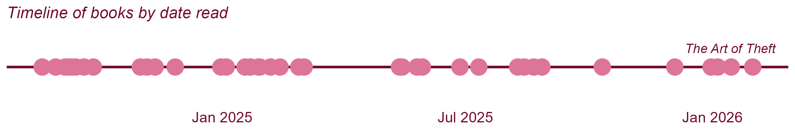

# Convert to interactive plotly object
#plotly::ggplotly(x, tooltip = "text") |> layout(hoverlabel=list(bgcolor="white"))
```

```{r num pages bar chart}
#| echo: false
#column: screen-insert
#layout-nrow: 1
# library


df_books2 <- df_books |> 
  mutate(plot_pages = pages/2,
         plot_pages_neg = (pages/2)*-1) |> 
  pivot_longer(cols = c("plot_pages", "plot_pages_neg"),
               names_to = "type",
               values_to = "value") |> 
  arrange(author) |> 
  mutate(label = case_when(
    value == max(value) & type == "plot_pages" ~ paste("Longest \n", name, "\n", pages, "pages"),
    value == min(value[value>0]) & type == "plot_pages" ~ paste("Shortest \n", name, "\n", pages, "pages"),
    TRUE ~ ""))

x_labels <- df_books2 |> filter(type == "plot_pages") |> pull(label)

y <- ggplot(df_books2, aes(x = factor(name, levels = unique(name)), y = value)) +
  geom_bar(
    stat = "identity", position = position_stack(), fill = "#CF1259", width = 0.09) +
  labs(x=NULL,y=NULL, title = "Number of pages read by book")+
  theme_minimal()+
  theme(
    text = element_text(size = 12),
    axis.text.y = element_blank(), # Remove y-axis text
    axis.text.x = element_text(color = "#710A31", vjust = 1.1),
    axis.ticks = element_blank(),  # Remove axis ticks
    panel.grid = element_blank(),   # Remove gridlines
    panel.border = element_blank(),
    plot.title = element_text(color = "#710A31", face = "italic")) +  
  scale_y_continuous(limits = c(min(df_books2$value) - 20, max(df_books2$value) + 20)) +
  scale_x_discrete(labels = x_labels)  # Custom x-axis labels

ggsave(filename = "charts/pages.png",
       plot = y, # last_plot()
       width = 9,
       height = 4,
       dpi = "retina",
       limitsize = FALSE)

#knitr::include_graphics("pages.png")
```

```{r book age scatterplot}
#| echo: false

df_books3 <- df_books |> 
  mutate(book_age = year(today()) - year_published,
         y_axis = runif(as.numeric(nrow(df_books)))) |> 
  filter(book_age <= 200)

oldest_book <- df_books3 |>  
  filter(book_age == max(book_age)) |> 
  mutate(label = paste(name, "\n", "published in", year_published))

z<-ggplot(df_books3, aes(x=book_age, y=y_axis)) + 
    geom_point(size=5, color="#CF1259")+
    labs(x=NULL,y=NULL, title = "Book age; years since publication")+
  theme_minimal()+
  theme(
    text = element_text(size = 18),
    axis.ticks = element_blank(),  # Remove axis ticks
    axis.text.y = element_blank(), # Remove y-axis text
    axis.text.x = element_text(color = "#710A31"),
    panel.grid = element_blank(),   # Remove gridlines
    panel.border = element_blank(),
    plot.title = element_text(color = "#710A31", face = "italic")) + 
  scale_x_continuous(breaks = range(df_books3$book_age)) +      # Show only min and max age on x-axis
  scale_y_continuous(limits = c(0, 1.4)) +
  geom_text(
    data = oldest_book, 
    aes(label = label),  # Label the tallest bar with its name
    vjust = -0.5,  # Adjust the vertical position of the label
    hjust = 0.9,
    color = "#710A31",  # Set label color
    size = 6       # Set label size
  ) 

ggsave(filename = "charts/ages.png",
       plot = z, # last_plot()
       width = 9,
       height = 4,
       dpi = "retina",
       limitsize = FALSE)

#knitr::include_graphics("ages.png")
  
```


```{r pie chart}
#| echo: false

sos <- goodreads_library_export |> 
  mutate(rating_group = factor(floor(`My Rating`), levels = 1:5))
  
  sos2 <- as.data.frame(table(sos$rating_group))
  colnames(sos2) <- c("rating", "count")

  sos2 <- sos2 %>%
    arrange(desc(rating)) |> 
    mutate(percentage = count / sum(count) * 100,  # Compute percentage
           cumulative = cumsum(count) - (count)/2,
           label = str_c(rating, " stars"))
# Pie chart
c<-ggplot(sos2, aes(x = 2, y = count, fill = rating)) +
  geom_bar(stat = "identity", width = 1) +
  coord_polar(theta = "y")+
  scale_fill_manual(values = c("#DD7596", "#CF1259", "#710A31", "#B7C3F3", "#4F6272")) +  # Custom colors
  labs(title = "Book Ratings Distribution", fill = "Star Rating") +
  geom_text( x=2.75, aes(y=cumulative, label=label), size=6, color = "#404E5C") +
  theme_void() +  # Remove axis lines, ticks, and background
  theme(
    plot.title = element_text(color = "#710A31", face = "italic", size = 18),
    legend.position = "none"
  )+
  xlim(c(0.5, 2.5))  # Creates the hole in the center


sos <- goodreads_library_export |> 
  mutate(Binding = case_when(
    Binding == "Paperback" | Binding == "Hardcover" ~ "Physical Copy",
    TRUE ~ Binding)) |> 
  arrange(desc(Binding)) |> 
  group_by(Binding) |> 
  mutate(count = n(),
         label = case_when(
           row_number() == 3 & Binding == "Kindle Edition" ~ Binding,
           row_number() == 10 & Binding == "Physical Copy" ~ Binding,
           TRUE ~ "")) 
  


b <- ggplot(sos, aes(x = 2, y = count, fill = reorder(Binding, count))) +
  geom_bar(stat = "identity", width = 1) +
  coord_polar(theta = "y") + # Turn into pie chart
  xlim(c(0, 2.5)) + # Turn into donut chart
  scale_fill_manual(values = c("#DD7596", "#CF1259")) +  # Custom colors
  theme_void() +
  theme(
    plot.title = element_text(color = "#710A31", face = "italic", size = 18),
    legend.position = "none") +
  labs(title = "Book Medium") +
  geom_text(
    aes(label = label),
    color = "#710A31",
    size = 6,
    position = position_stack(vjust = 0.5))

ggsave(filename = "charts/pie.png",
       plot = b, # last_plot()
       width = 4.5,
       height = 4.5,
       dpi = "retina",
       limitsize = FALSE)

#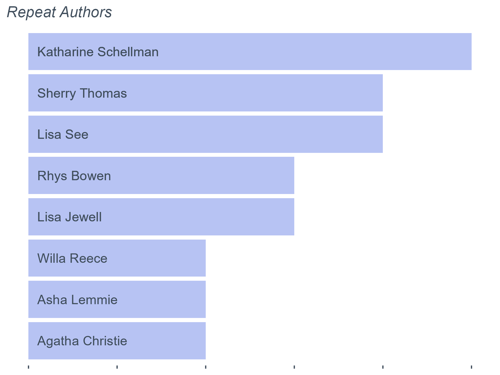

```

```{r author count bar chart}
#| echo: false

w <- df_books3 %>%
  group_by(author) %>%
  mutate(n_books = n()) %>%
  ungroup() |> 
  filter(n_books > 1) %>%
  ggplot(aes(x = reorder(author, n_books))) +  
  geom_bar(aes(fill = after_stat(count == 1)), stat = "count") +
  coord_flip() +
 geom_text(aes(label = author, y = 0.1),  # Place text at Y = 0
            angle = 0, color = "#404E5C", size = 4, hjust = 0) +
  scale_fill_manual(values = c("TRUE" = "#EEF0FC", "FALSE" = "#B7C3F3")) +
  theme_minimal() +
  theme(
    text = element_text(color = "#404E5C"),
    axis.ticks.y = element_blank(),  # Remove axis ticks
    axis.ticks.x = element_line(color = "#404E5C"),  # Keep Y-axis tick marks
    axis.text = element_blank(), # Remove y-axis text
    panel.grid = element_blank(),   # Remove gridlines
    panel.border = element_blank(),
    legend.position = "none",
    plot.title = element_text(face = "italic")) +  
  labs(x=NULL,y=NULL, title = "Repeat Authors")

ggsave(filename = "charts/bar.png",
       plot = w, # last_plot()
       width = 6,
       height = 4.5,
       dpi = "retina",
       limitsize = FALSE)
```


<!-- SET OF COLUMNS -->
<!-- SET OF COLUMNS -->
<!-- SET OF COLUMNS -->

:::: {.columns}

::: {.column width="30%"}
`r knitr::include_graphics("charts/pie.png")`
:::

::: {.column width="10%"}
<!-- empty column to create gap -->
:::

::: {.column width="60%"}
`r knitr::include_graphics("charts/bar.png")`
:::

::::

```{r pages year bar chart}
#| echo: false
soup <- df_books3 |> 
  mutate(year = as.character(year(date))) |> 
  group_by(year) |> 
  mutate(total_pages = sum(pages),
         label = str_c(scales::label_comma()(total_pages), " pgs")) |> 
  distinct(year, total_pages, label) |> 
  ungroup() |> 
  add_row(year = "2023", total_pages = 0, label = "0 pgs") # add 0 for context

c <- ggplot(soup, aes(total_pages, factor(year))) +
  geom_col(fill = "#DD7596", width = 0.5) +  
  labs(x=NULL,y=NULL, title = " ")+
  geom_text(aes(label = label), color = "#DD7596", hjust = -0.1, size = 8) +
  scale_x_continuous(expand = expansion(mult = c(0, 0.5))) +
  theme_void() +
  theme(legend.position = "none", 
        axis.text.y = element_text(color = "#404E5C", size = 35), 
        text = element_text(size = 35)) +
  geom_vline(xintercept = 0, color = "black", linewidth = 1)


ggsave(filename = "charts/pagesyear.png",
       plot = c,
       width = 6,
       height = 4,
       dpi = "retina",
       limitsize = FALSE)


```

<!-- SET OF COLUMNS -->

:::: {.columns}

::: {.column width="100%"}
`r knitr::include_graphics("charts/pages.png")`
:::

::::

<!-- SET OF COLUMNS -->
<!-- SET OF COLUMNS -->
<!-- SET OF COLUMNS -->

:::: {.columns}

::: {.column width="30%"}
`r knitr::include_graphics("charts/pagesyear.png")`
:::

::: {.column width="10%"}
<!-- empty column to create gap -->
:::


::: {.column width="60%"}
`r knitr::include_graphics("charts/ages.png")`
:::

::::


```{r book heatmap}
#| echo: false
#| 
heat_data <- df_books %>%
  filter(!is.na(date)) %>%
  mutate(
    year  = year(date),
    month = month(date, label = TRUE, abbr = TRUE)
  ) %>%
  count(year, month)


u <- ggplot(heat_data, aes(month, factor(year), fill = n)) +
  geom_tile(color = "white", linewidth = 0.3) +
  geom_text(aes(label = n), color = "white", size = 4) +
  scale_x_discrete(position = "top") +
  scale_fill_gradient(
    low = "#F7CAD0",
    high = "#CF1259"
  ) +
  labs(x = NULL, y = NULL) +
  theme_minimal(base_size = 16) +
  theme(
    panel.grid = element_blank(),
    axis.text.x = element_text(color = "#710A31", margin = margin(b = 5)),
    axis.text.y = element_text(color = "#710A31", margin = margin(r = 6)),
    axis.ticks = element_blank(),
    legend.position = "none"
  )

ggsave(filename = "charts/heatmap.png",
       plot = u, # last_plot()
       width = 9,
       height = 1.5,
       dpi = "retina",
       limitsize = FALSE)
```
<!-- SET OF COLUMNS -->
<!-- SET OF COLUMNS -->
<!-- SET OF COLUMNS -->
<br>
<br>

:::: {.columns}

::: {.column width="100%"}
`r knitr::include_graphics("charts/heatmap.png")`
:::

::::

## Reviews

:::: {.columns}

::: {.column width="25%"}
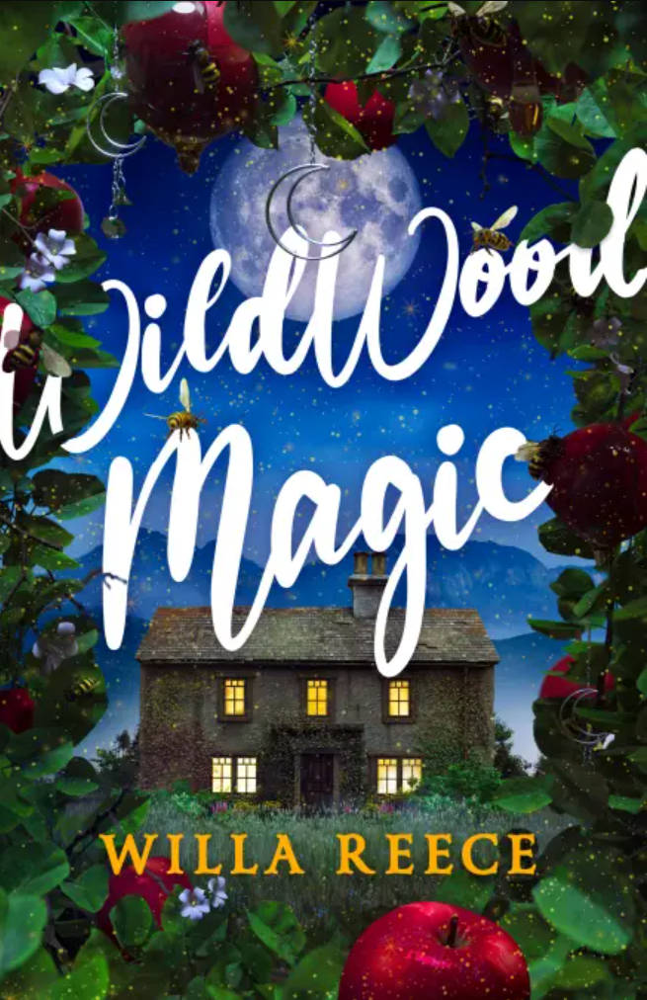{width=1.5in}
:::

::: {.column width="10%"}
<!-- empty column to create gap -->
:::

::: {.column width="25%"}

`r goodreads_library_export |> clean_names() |> filter(title == "Wildwood Magic") |> pull(my_review)`
:::

::::
<br>

<!-- SET OF COLUMNS -->
<!-- SET OF COLUMNS -->
<!-- SET OF COLUMNS -->

:::: {.columns}

::: {.column width="25%"}

`r goodreads_library_export |> clean_names() |> filter(title == "The Body in the Garden (Lily Adler Mystery, #1)") |> pull(my_review)`
:::

::: {.column width="10%"}
<!-- empty column to create gap -->
:::

::: {.column width="25%"}
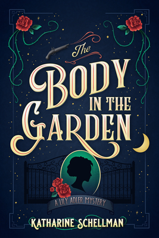{width=1.5in}
:::


::::

## All Books 

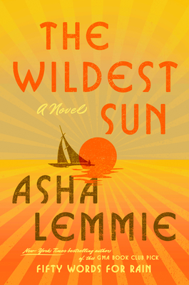{width=1.5in}
{width=1.5in}
{width=1.5in}
{width=1.5in}
{width=1.5in}

{width=1.5in}
{width=1.5in}
{width=1.5in}
{width=1.5in}
{width=1.5in}

{width=1.5in}
{width=1.5in}
{width=1.5in}
{width=1.5in}
{width=1.5in}

{width=1.5in}
{width=1.5in}
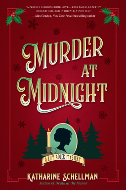{width=1.5in}
{width=1.5in}
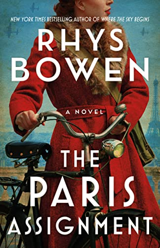{width=1.5in}

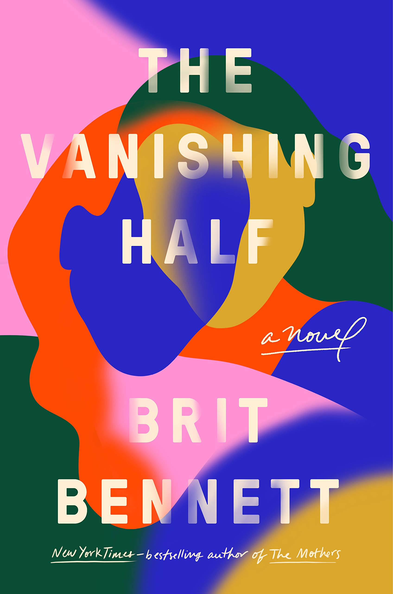{width=1.5in}
{width=1.5in}
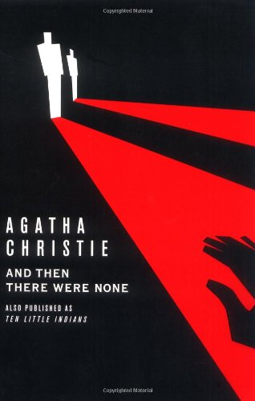{width=1.5in}
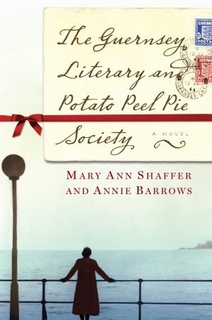{width=1.5in}
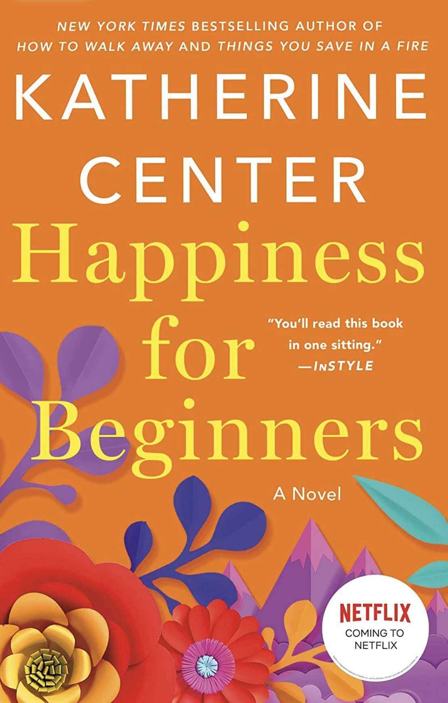{width=1.5in}

{width=1.5in}
{width=1.5in}
{width=1.5in}
{width=1.5in}
{width=1.5in}

{width=1.5in}
{width=1.5in}
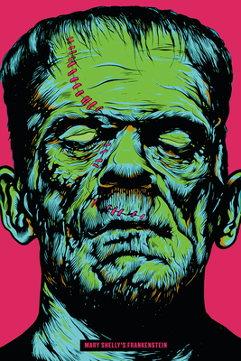{width=1.5in}
{width=1.5in}
{width=1.5in}

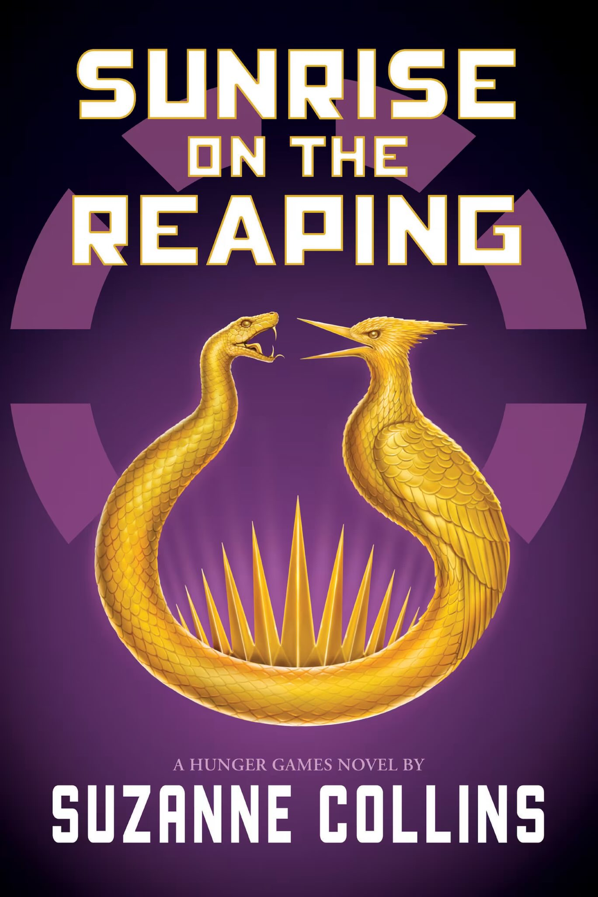{width=1.5in}
{width=1.5in}
{width=1.5in}
:::